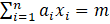

# Knapsack_cryptosystem
A number of cryptographic systems have been developed based on the knapsack problem. The first of these was the Merkle-Hellman system, which is described in the presented problem.

There is an ordered set of numbers (a1, a2, ... an) (this set is called a knapsack or a knapsack vector) and a number m. 
It is required to indicate a binary vector (x1, x2, ... xn) for which the equality x1*a1 + x2*a2 + ... + xn*an = m holds.

#### Key Generation:

1. select some super-growing knapsack;
2. choose the number k (k > a1 + a2 + ... + an);
3. сhoose a number c coprime to k;
4. a knapsack-trap is formed (b1, b2, ... bn) = c (a1, a2, ... an) (mod k), which is the public key;
5. numbers c and k are private keys.

#### Encryption algorithm

1. public text is represented as a binary sequence;
2. the sequence is divided into blocks of length n;
3. each block (x1, x2, ... xn) is replaced by a number m calculated according to the rule
.

#### Decryption Algorithm

1. find the initial super-growing knapsack: (a1, a2, ..., an) = (c)^(−1) * (b1, b2, ... bn) (mod k).
2. for each element m, the cipher of the text computes as m' = (c)^(−1) * m.
3. solve knapsack problem for the calculated m' and the knapsack (a1, a2, ..., an). Find block of the public text (x1, x2, ..., xn).
